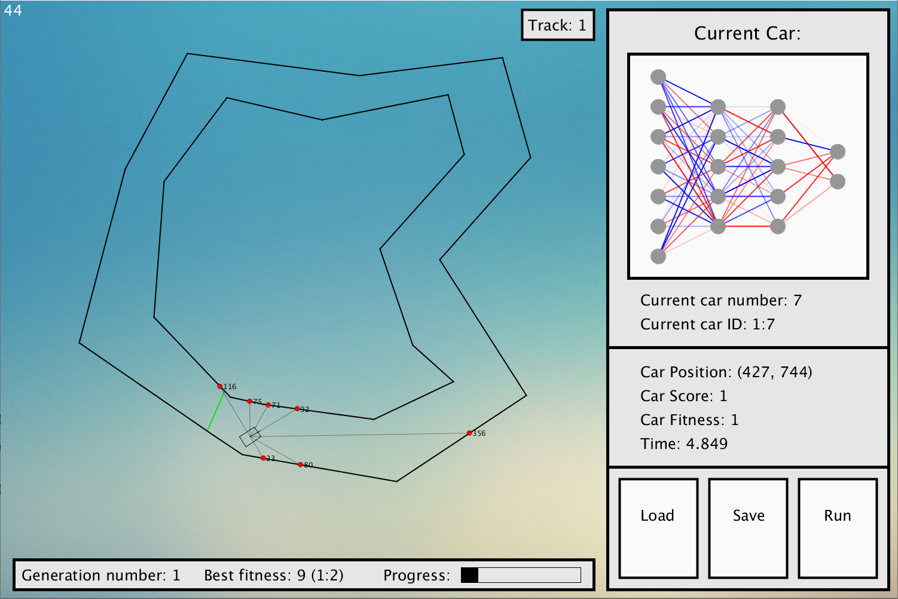

# Neuroevolution Vehicles

## About

<table>
<tr>
<td>
  


</td>
</tr>
</table>

Neural network library with genetic algorithms for network selection applied to a 2D physics based vehicle simulator, around 2 included tracks.Written in Python and Processing.

## Getting Started

These instructions will get you a copy of the project up and running on your local machine for development and testing purposes. See deployment for notes on how to deploy the project on a live system.

### Prerequisites

Ensure that you have the following prerequisites installed:

* Python - [Download and install version 3.7.4 +](https://www.python.org/)
* Processing - [Download and install version 3.5.3 +](https://py.processing.org/)

### Installation

Ensure Processing is installed with Python language extension. Then clone the repository:

```
git clone https://github.com/ethanrange/neuroevolution-vehicles.git
```
Then open `NeuroevolutionVehicles/NeuroevolutionVehicles.pyde` and run.

## Usage

The program provides 3 primary actions, indicated by the buttons at the bottom right of the window. Firstly, the desired track may be selected with the toggle track button in the upper right hand corner. 2 default tracks are provided.

### Starting Training

Select the desired track, then select run. The program will continue to run indefinitely, producing incrementally better vehicle AIs.

### Saving Networks

To save the currently running network, select the save button. A dialog box will appear allowing for the selection of the save location.

Networks are saved in JSON format.

### Loading Networks

To load a network, select the load button, and then a suitable JSON file from the dialog window provided. Note that loading a network will erase training progress.

Several networks are provided in the `Saved Networks` folder. Successful vehicles for each track are included, as well as an random assortment of other networks.

## License

This project is licensed under the MIT License - see the [LICENSE.md](LICENSE.md) file for details